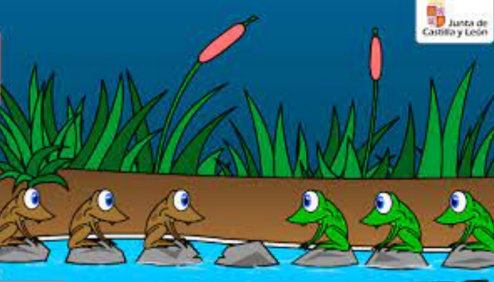

# Inteligencia Artificial - Teoría de las Inteligencias Múltiples (Ensayo por Ángel Arreola)
    Tarea 8 - Soluciones por José Ángel Arreola González | Reglas y Búsquedas: Espacio de Estados


## Problema de las Ranitas: Análisis y Solución

### Introducción

Este problema, explorado en nuestra clase de Inteligencia Artificial ([Link a solución desarrollada en clase](./03_RanasSaltarinas.md))
, presenta un desafío interesante que involucra la planificación de movimientos y la generación de un espacio de estados. Se trata de un puzzle donde el objetivo es intercambiar posiciones entre grupos de ranas verdes y marrones situadas en lados opuestos de un conjunto de piedras.

### Descripción del Problema

Las ranas están dispuestas en dos grupos, separados por un espacio vacío. El desafío es mover las ranas verdes al lado donde inicialmente se encuentran las marrones y viceversa, siguiendo ciertas reglas.



### Reglas

- **Estado Inicial:** `lb,lb,lb,__,rr,rr,rr` (donde `lb` representa una rana marrón, `rr` una rana verde y `__` un espacio vacío).
- Las ranas solo pueden moverse hacia adelante.
- El movimiento es posible a un espacio vacío adyacente o saltando sobre una rana si hay un espacio vacío después de esta.

### Medidas de Rendimiento

- **Estado de Aceptación:** `rr,rr,rr,__,lb,lb,lb`.
- El objetivo es alcanzar este estado en el menor número de movimientos posibles.

### Espacio de Soluciones

El espacio de soluciones se refiere a todas las posibles configuraciones del tablero que se pueden alcanzar desde el estado inicial hasta el estado de aceptación. Cada movimiento de una rana altera el estado del tablero, creando un nuevo estado en el espacio de soluciones.

### Ejemplo de Secuencia de Movimientos

```markdown
1. lb,lb,__,lb,rr,rr,rr
2. lb,__,lb,lb,rr,rr,rr
3. __,lb,lb,lb,rr,rr,rr
4. rr,lb,lb,lb,__,rr,rr
5. rr,rr,lb,lb,__,lb,rr
6. rr,rr,rr,lb,__,lb,lb
7. rr,rr,rr,__,lb,lb,lb
```

Esta secuencia muestra uno de los caminos para alcanzar el estado de aceptación. Es crucial entender que cada paso abre nuevas posibilidades y caminos.

### Análisis Detallado

El problema de las ranitas es un ejemplo clásico de los desafíos encontrados en la inteligencia artificial, específicamente en la planificación de movimientos y la generación de un espacio de estados. Cada movimiento lleva a un nuevo estado, que puede ser analizado para determinar el siguiente mejor movimiento. Este proceso de toma de decisiones es análogo a cómo una inteligencia artificial podría abordar problemas de planificación y optimización.

La solución óptima es aquella que alcanza el estado de aceptación en el menor número de movimientos. Esto requiere una comprensión profunda de cómo cada movimiento afecta las posibilidades futuras y la habilidad para anticipar las consecuencias de cada acción.

Gracias por compartir los detalles del problema y tu solución propuesta. A continuación, redactaré un análisis detallado y completo en formato Markdown para el problema de los misioneros y los caníbales, tomando como referencia tu solución y añadiendo detalles adicionales para una comprensión completa del problema y su resolución.

---
---

## Problema de los Misioneros y Caníbales

### Contexto
Este problema fue discutido en nuestra clase de Inteligencia Artificial junto con otro problema similar de un Granjero con animales y un vegetal. Es un ejemplo clásico de desafíos de planificación y lógica en la IA. Se propuso una solución en dicha clase pero en el documento presente se terminara de concretar. [Enlace a mis apuntes de la clase](./02_Ejercicio_RioDeUnLadoParaOtro.md).

Este es un clásico problema de lógica y planificación en inteligencia artificial. Tres misioneros y tres caníbales deben cruzar un río en un bote que solo puede llevar a dos personas a la vez. El reto es cruzar a todos sin que en ningún momento los caníbales superen en número a los misioneros en ninguna de las orillas, para evitar que los misioneros sean devorados.

### Descripción del Problema

Los misioneros y caníbales están inicialmente en una orilla del río y deben llegar al otro lado. El bote disponible solo puede llevar a dos personas, y en ningún momento los caníbales pueden superar en número a los misioneros en ninguna orilla, o los misioneros estarán en peligro.


### Reglas

- Inicio: Todos los misioneros y caníbales están en una orilla del río.
- El bote no puede llevar más de dos personas a la vez.
- En ningún momento los caníbales pueden superar en número a los misioneros en ninguna orilla.

### Medidas de Rendimiento

- Todos los misioneros deben sobrevivir.
- El objetivo es cruzar a todos en el menor número de viajes posibles.
- Mantener el número de caníbales siempre menor o igual al número de misioneros.

### Solución Propuesta

La solución al problema implica una serie de viajes en el bote, cuidando siempre la proporción entre misioneros y caníbales. La siguiente secuencia muestra una posible solución:

```markdown
1. M M M C C C _____________________ Orilla vacía
2. M M C C _____________________ M C (2 viajan)
3. M M C C M _____________________ C (1 regresa)
4. M M M _____________________ C C C (2 viajan)
5. M M M C _____________________ C C (1 regresa)
6. M C _____________________ M M C C (2 viajan)
7. M C M C _____________________ M C (2 regresan)
8. C C _____________________ M M M C (2 viajan)
9. C C C _____________________ M M M (1 viaja)
10. C _____________________ M M M C C (2 viajan)
11. C C _____________________ M M M (1 regresa)
12. _____________________ M M M C C C (2 viajan)
```

Esta secuencia garantiza que en todo momento, el número de misioneros en cualquier orilla sea igual o mayor que el número de caníbales, evitando así cualquier peligro para los misioneros.

### Análisis Detallado

Este problema es un excelente ejemplo de cómo los algoritmos de búsqueda y planificación en inteligencia artificial pueden abordar situaciones donde hay que considerar múltiples factores y restricciones. La solución óptima requiere no solo considerar los movimientos inmediatos, sino también anticipar las consecuencias futuras de estos movimientos para asegurar la seguridad de todos los involucrados.